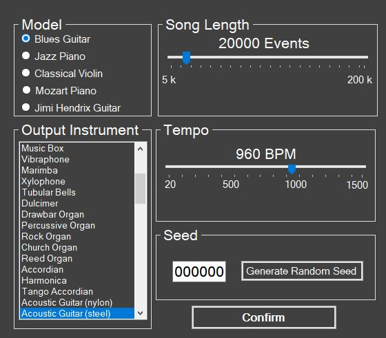

## Team 19 Members:

Nicholas Harris

David Neilsen

Joseph San Nicolas

Stefan Stukelja

### Instructors

Sergiu Dascalu

Devrin Lee

### Extrenal Advisor

Dave Feil-Seifer

Benjamin Brown

### What is MelodyBot about?

The main purpose of MelodyBot is create a functional artificial intelligence which can generate music samples, with plans of songs in the future.  The music samples are based on the genre that is specified by the user.  The artificial intellingence is able to achieve this through neural networks that utilizes samples of the selected genre to assist in generating the music samples.  A secondary goal for MelodyBot is customer satisfaction.  In order to achieve this, MelodyBot needs to be consistent in creating music samples that match the genre that the users specified.  This goal can be achieved by improving the training in MelodyBot’s neural network.

Currently, the neural network of MelodyBot prototype is able to generate music samples that are musical notes that are played at random beats.  The neural network now have 5 models that it produces it samples based on: classical violin, jazz piano, blues guitar, Mozart piano, and Jimi Hendrix guitar.  Before, the samples could only be played with three different instruments: piano, violin, and guitar.  Now the samples can be played by 30+ different instruments, including: saxaphone, xylphone, etc.  The developers of MelodyBot also have created functioning user interface prototypes in Python and Visual Basic.  The current UI prototypes are able to load sound files in a viewable list, play and stop/pause said sound files, and remove the sound files from the list.  In addition, the team has made it possible for the user to choose the model of the sample, the tempo, the length, and the output instrument of the sample, all within the new and improved UI.  The team's next step in development is improving the machine learning of the neural network.  

### Progress of MelodyBot

#### Current User Interface

#### Example Audio Files

### Project Related Readings

- Virtual Music - Computer Synthesis of Musical Style by David Cope (Book)

- [Recurrent Neural Network Regularization (Paper)](https://arxiv.org/pdf/1409.2329.pdf)

- [Generating Sequences With Recurrent Neural Networks (Paper)](https://arxiv.org/pdf/1308.0850.pdf)

- [The Unreasonable Effectiveness of Recurrent Neural Networks (Blog Post)](http://karpathy.github.io/2015/05/21/rnn-effectiveness/)

